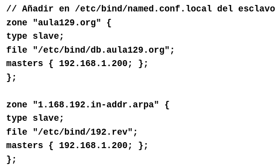
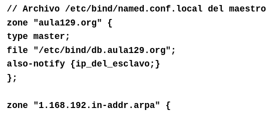

# Servidor DNS esclavo 

Un servidor DNS esclavo es aquel que para resolver las consultas de direcciones debe hacer las peticiones a un servidor maestro ya que por sí mismo no contiene ningún registro. Su función principal es reducir la carga del servidor maestro, de forma que el esclavo es el que resuelve las consultas de los usuarios, evitando que el maestro haga esta tarea.

## 1. Configuración de un DNS esclavo
Para configurar un DNS esclavo lo único que debemos hacer es indicar quién es el servidor maestro de su zona y en el archivo de configuración del maestro añadir al esclavo.

En resumen, debemos tocar tres archivos diferentes, dos en el maestro y una en el esclavo.

## En el maestro modificaremos los archivos

`/etc/bind/db.aula129.org`
Añadiendo el nuevo servidor esclavo

`/etc/bind/192.rev`

## En el esclavo modificaremos el archivo
`/etc/bind/named.conf.local`
Aquí en `type` indicamos que es esclavo y además añadimos a qué maestro debe hacer las peticiones

De forma optativa, en el servidor maestro podemos añadir la línea `also-notify` para que se mantenga sincronizado de forma que cuando haya un cambio de zona, pase del maestro al esclavo

